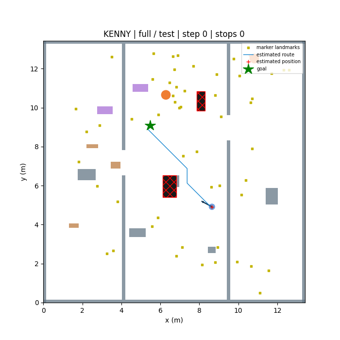

# KENNY lightweight RL environment

A runnable Gymnasium navigation simulator and PPO training pipeline for a small indoor robot. It uses height-aware boxes and analytical sensor rays instead of a full physics/rendering engine, so the laptop does not need Gazebo, ROS, or GPU rendering during training.

**This is a training environment, not a validated autonomous robot controller.** The simulator approximates LiDAR, depth, marker localization and wheel motion. Use it for learning and debugging, then validate in Gazebo and on guarded hardware before deployment. The current ROS/robot roadmap is in [the robot setup guide](docs/RL_TRAINING_AND_ROBOT_GUIDE.md).



## Your robot

| Parameter | Configured value |
| --- | --- |
| Body width × length | 0.23 × 0.23 m |
| Total height | 0.485 m |
| Wheel track | 0.235 m, interpreted as wheel-center to wheel-center |
| Wheel diameter | 0.080 m |
| Gearmotor | 333 RPM JGB37-520; nominal wheel surface speed ≈1.395 m/s |
| Policy speed limits | 0–0.30 m/s, ±0.60 rad/s |
| Control rate | 10 Hz |
| LiDAR approximation | Horizontal scan at provisional 0.22 m height; 72 angular bins |
| Depth approximation | 36 horizontal × 9 vertical rays, reduced to collision-height ranges |
| Markers | Floor landmarks with visibility, occlusion, missed detections and noisy pose fixes |

**Confirm whether 23.5 cm is wheel-center spacing or the gap between tyre inner edges.** Camera mounting (provisionally 0.40 m high), field of view, ranges, sensor rate, acceleration and braking are configurable assumptions, not verified X3 Pro/Astra Pro calibration values. The robot collision footprint is a conservative circle enclosing the square body. Measure wheel protrusions and caster extent too.

## Install on the laptop

Supported Python: **3.10–3.12**. The system Python on this machine is 3.14, so use the separate Python 3.10 interpreter. From this repository, using `uv`:

```bash
uv venv --python python3.10 .venv
uv pip install --python .venv/bin/python torch==2.5.1 --index-url https://download.pytorch.org/whl/cpu
uv pip install --python .venv/bin/python -e '.[train,view,test]'
source .venv/bin/activate
```

A `.venv` with these packages has already been created in this workspace. On a fresh machine without `uv`, create a standard venv with `python3.10 -m venv .venv`, activate it, then use `python -m pip install` in place of `uv pip install --python .venv/bin/python`.

The CPU wheel avoids installing a large CUDA stack on your 8 GB laptop. SB3 specifically recommends CPU execution for small PPO MLPs; the RTX 2050 is optional here. Pinning PyTorch 2.5.1, SB3 2.4.1 and Gymnasium 1.0.0 keeps the tested API combination reproducible. [SB3 PPO guidance](https://stable-baselines3.readthedocs.io/en/master/modules/ppo.html), [PyTorch version-specific installers](https://pytorch.org/get-started/previous-versions/)

## Preview and validate

```bash
# Windowed top-down view: debug route follower, not a trained agent.
python -m kenny_rl.demo --stage full --seed 42

# No window required; creates a PNG.
python -m kenny_rl.demo --stage full --snapshot artifacts/world.png

# Headless speed/RAM check, followed by functional tests.
python -m kenny_rl.benchmark --steps 1000 --stage full
python -m pytest -q

# A very short end-to-end installation check, NOT navigation training.
python -m kenny_rl.train --config configs/smoke.json --run runs/my-smoke
```

You can also request a specific goal, for example:

```bash
python -m kenny_rl.demo --stage empty --start 1 1 --goal 8 9 --steps 1200
```

Coordinates are meters from the synthetic room's lower-left boundary; `(0,0)` is a wall corner here, so the robot cannot spawn there. Your real marker-map origin can be elsewhere: translate the site map and landmarks consistently. Custom points are rejected if occupied; connectivity is guaranteed for generated missions, but not for arbitrary manual goals.

In the view: grey = walls, teal = chairs, brown = low bags, purple = overhangs, orange = moving people, black/red = floor gaps, yellow squares = markers, blue circle = robot, red cross = estimated position, green star = goal. The drawn route is computed from the structural map and observed hazards; it can initially cross unseen clutter or a hidden drop.

Rendering is optional and off in all training workers. For a headless machine with an unwritable home cache, set `MPLCONFIGDIR=/tmp/kenny-mpl` before creating a snapshot.

## Train progressively

Start with one environment and the laptop configuration:

```bash
python -m kenny_rl.train --config configs/laptop.json --run runs/empty-0 --stage empty --steps 100000 --seed 0
```

This is a starting experiment budget, not an assertion that 100,000 transitions will converge. Look at validation success, collisions, timeouts and interventions. Train longer if necessary; do not advance merely because the command finished.

Resume the actor/critic and optimizer into a **new** output directory. The environment's random episode stream starts from the new seed, so this is training continuation, not bit-for-bit mid-episode replay:

```bash
python -m kenny_rl.train --config configs/laptop.json --run runs/static-0 --resume runs/empty-0/final.zip --stage static --steps 200000 --seed 0
```

Proceed through these stages, retaining and evaluating earlier checkpoints:

| Stage | What the world contains |
| --- | --- |
| `empty` | Room boundary; shorter randomized goals |
| `static` | Blocks, wall openings, turns and detours |
| `mixed` | Static layouts plus chair parts, low bags and hanging obstacles |
| `dynamic` | Mixed layouts plus walking people and periodically moved/placed bags |
| `cliffs` | Mixed layouts plus unsupported floor patches |
| `full` | All obstacle types, people, changing clutter and floor gaps |

All stages randomize positions and start/goal headings. Full worlds vary in size, layout, obstacle combinations, motor gain, slip, command delay and acceleration response. Sensor noise/dropouts and marker occlusion remain active. The curriculum is **manual**, not an automatic stage scheduler; evaluate simpler stages again to catch forgetting. Three or more independent training seeds are recommended.

Runs contain:

- `final.zip`, periodic `checkpoints/`, and `best.zip` after the first validation.
- `config.json`, `contract.json`, dependency versions, seed and source hashes.
- `validation.jsonl` with per-episode results and aggregate metrics.
- TensorBoard events, viewable with `tensorboard --logdir runs`.

`best.zip` uses observed collision/cliff rates first, then success and intervention fraction. Small validation samples are noisy; inspect records before selecting a release candidate. Ctrl+C saves `interrupted.zip`. Existing run directories are rejected to avoid overwriting experiments. Resume rejects changed robot/observation contracts; start fresh after changing physical dimensions or sensor feature layout.

## Evaluate new layouts and dynamic changes

```bash
python -m kenny_rl.evaluate --model runs/static-0/final.zip --split test --stage full --episodes 100 --output artifacts/test-full.json
python -m kenny_rl.evaluate --model runs/static-0/final.zip --split stress --stage full --episodes 100 --output artifacts/stress-full.json

# Simulation-only ablation: reveals how much the guard rescues the policy.
python -m kenny_rl.evaluate --model runs/static-0/final.zip --split test --stage full --episodes 100 --unshielded --output artifacts/unshielded.json

# Watch a trained checkpoint in a newly generated world.
python -m kenny_rl.demo --model runs/static-0/final.zip --stage full --seed 700
```

The example paths must point to checkpoints you actually trained. A static-only policy is not expected to pass the full test suite; these commands illustrate how to reveal that gap.

Train/validation/test use distinct seeded random streams. Stress testing additionally introduces larger worlds and U-shaped traps not included in the training generator. A change in seed is not proof of real-world generalization; use measured school layouts in later Gazebo tests. Do not tune on the final test seeds.

A successful run must reach the goal and slow down; wall contact, cliff entry and timeouts are separate outcomes. Reports include localization error, traveled distance, interventions and clutter changes. Inspect performance by stage, and count guarded collisions as failures. Run at least 500 held-out episodes across trained seeds before considering physical validation; zero observed falls in simulation is not a safety guarantee.

## Move to the school server

Copy the source, configurations, and the complete chosen run directory. Do not copy the laptop's `.venv`. Create a fresh Python 3.10–3.12 environment on the server and install the same package versions.

First test the CPU configuration, increasing from two workers to eight only after checking CPU availability and memory:

```bash
python -m kenny_rl.train --config configs/server.json --envs 2 --run runs/server-check --stage full --steps 4096
python -m kenny_rl.train --config configs/server.json --run runs/server-0 --resume runs/static-0/final.zip --stage full --steps 1000000
```

Server defaults: up to 8 spawned simulation workers per GPU learner, 512 rollout steps per worker, 512-sample minibatches, 2 conservative PPO epochs, and target KL 0.005. The sweep launcher defaults to four CUDA devices and four independent seeds, scales worker counts to CPU allocation, and checks CUDA before starting. Training is headless. See the [sim-to-real audit and server instructions](docs/SIM_TO_REAL_AUDIT.md) for disturbance settings, transfer gaps, installation and curriculum continuation.

**Four A5000s do not automatically accelerate a single SB3 PPO learner.** This implementation can run four independent seeds/experiments, one per device. It does not implement synchronous multi-GPU PPO, and the geometric simulator remains CPU-based. Start with one server job; check the school's scheduler/resource rules before launching more.

For a fresh server experiment, first learn basic goal reaching with
`configs/server_bootstrap.json`. It uses empty geometry without dynamics or
sensor disturbances and shorter episodes. Advance only after held-out validation
shows that PPO can stop at the goal. Then resume into `configs/server.json` on
the empty stage to add measured-motion surrogates, noise, dropout, delays and
outage bursts. `best.zip` prioritizes successful navigation, then observed
collision/cliff rate and intervention rate; release evaluation still requires
zero observed contacts.

For GPU experiments, install the matching CUDA build in a fresh server environment. The following is the official CUDA 12.4 wheel family for the pinned PyTorch version; first verify the server's NVIDIA driver supports it:

```bash
uv pip install --python .venv/bin/python torch==2.5.1 --index-url https://download.pytorch.org/whl/cu124
uv pip install --python .venv/bin/python -e '.[train,view,test]'
.venv/bin/python -c 'import torch; print(torch.cuda.is_available(), torch.cuda.device_count())'
```

Then preview the commands before scheduling a sweep:

```bash
python scripts/server_sweep.py --output runs/a5000-sweep --stage empty --dry-run
# When resources are allocated, repeat without --dry-run to execute.
```

The sweep starts independent runs from scratch, or continues per-seed checkpoints with `--resume-from runs/previous-sweep`. Eight workers plus one learner per GPU needs 36 CPU slots; on 32 allocated slots the launcher selects seven workers/run. Use `--cpu-budget` to specify a scheduler allocation not reflected in CPU affinity, or `--envs` for an explicit worker count. Use `--devices cpu` for sequential CPU seed experiments. Model weights are portable between CPU and CUDA. Start fresh with the v3 contract: older checkpoints are rejected because route progress, rewards and guard behavior changed.

## What generalizes, and what still needs validation

The actor sees local range features, route-relative coordinates, estimated motion and localization health—not a fixed school map, marker ID sequence, hidden obstacles or perfect simulator pose. Global A* routing allows detours that temporarily increase straight-line goal distance. Moving people and relocated bags force fresh local responses and periodic replanning.

However, this version assumes **a supplied structural wall map for the current site**, as would be obtained using SLAM before navigation. Unknown clutter and cliffs are revealed through sensor surrogates; this is not a complete exploration/SLAM implementation for a building with no map. New environments can supply new maps without changing the policy interface.

Important fidelity limits:

- Geometric depth rays approximate collision-height features; no RGB rendering, real ArUco image detection, material/lighting model, or Orbbec driver runs here.
- Wheel motion has acceleration, gain/slip variation and delay, but no electrical motor simulation, encoder pulse model, actual PID firmware, suspension, tipping or full rigid-body physics.
- Cliff events use intersection of the conservative footprint with a missing-floor rectangle; the robot does not physically fall in this simulator.
- The simulated guard uses measured features, not hidden geometry, and can miss hazards. Three downward sensor surrogates assume **additional physical cliff sensors**; the original LiDAR/Astra pair is insufficient as the sole cliff safeguard.
- Dynamic-object memory expires; it is not a production tracking or occupancy-fusion system. A blocked route stops and replans; autonomous recovery and hand-command handling are not implemented here.
- No ROS node or ONNX exporter is included yet. A ROS adapter must reproduce `contract.json`, frame ordering, sensor calibration, fixed normalization and action scaling, then pass Gazebo and hardware timing/safety tests.

See [the simulator design and validation notes](docs/LIGHTWEIGHT_SIMULATOR.md) for the observation contract, reward and measured checks.
