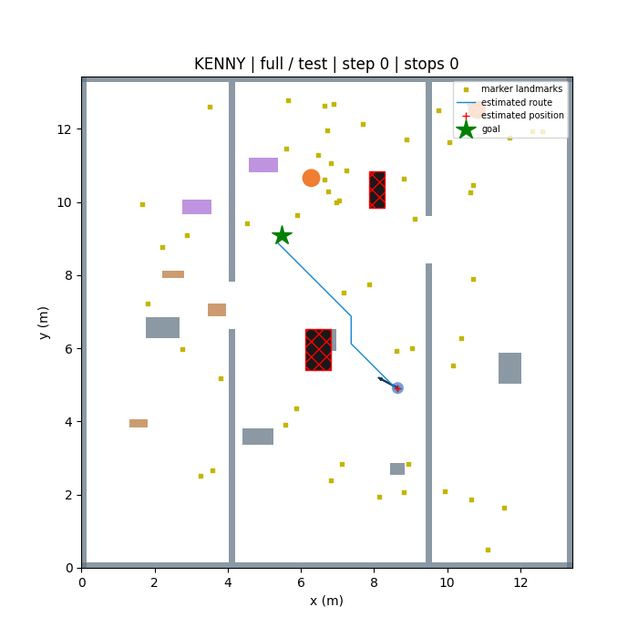

# KENNY lightweight RL environment

A runnable Gymnasium navigation simulator and PPO training pipeline for a small indoor robot. It uses height-aware boxes and analytical sensor rays instead of a full physics/rendering engine, so the laptop does not need Gazebo, ROS, or GPU rendering during training.

**This is a training environment, not a validated autonomous robot controller.** The simulator approximates LiDAR, depth, marker localization and wheel motion. Use it for learning and debugging, then validate in Gazebo and on guarded hardware before deployment. The current ROS/robot roadmap is in [the robot setup guide](docs/RL_TRAINING_AND_ROBOT_GUIDE.md).

For Raspberry Pi 5, follow the [installation and live 3D depth GUI guide](docs/PI5_SETUP.md). The [tested Pi status](docs/PI5_SETUP_STATUS.md) records measured results and remaining hardware issues.



## Your robot

| Parameter | Configured value |
| --- | --- |
| Body width × length | 0.23 × 0.23 m |
| Total height | 0.485 m |
| Wheel track | 0.235 m, interpreted as wheel-center to wheel-center |
| Wheel diameter | 0.080 m |
| Gearmotor | 333 RPM JGB37-520; nominal wheel surface speed ≈1.395 m/s |
| Policy speed limits | 0–0.30 m/s, ±0.60 rad/s |
| Control rate | 10 Hz |
| LiDAR approximation | Horizontal scan at provisional 0.22 m height; 72 angular bins |
| Depth approximation | 36 horizontal × 9 vertical rays, reduced to collision-height ranges |
| Markers | Floor landmarks with visibility, occlusion, missed detections and noisy pose fixes |

**Confirm whether 23.5 cm is wheel-center spacing or the gap between tyre inner edges.** Camera mounting (provisionally 0.40 m high), field of view, ranges, sensor rate, acceleration and braking are configurable assumptions, not verified X3 Pro/Astra Pro calibration values. The robot collision footprint is a conservative circle enclosing the square body. Measure wheel protrusions and caster extent too.

## Install on the laptop

Supported Python: **3.10–3.12**. The system Python on this machine is 3.14, so use the separate Python 3.10 interpreter. From this repository, using `uv`:

```bash
uv venv --python python3.10 .venv
uv pip install --python .venv/bin/python torch==2.5.1 --index-url https://download.pytorch.org/whl/cpu
uv pip install --python .venv/bin/python -e '.[train,view,test]'
source .venv/bin/activate
```

A `.venv` with these packages has already been created in this workspace. On a fresh machine without `uv`, create a standard venv with `python3.10 -m venv .venv`, activate it, then use `python -m pip install` in place of `uv pip install --python .venv/bin/python`.

The CPU wheel avoids installing a large CUDA stack on your 8 GB laptop. SB3 specifically recommends CPU execution for small PPO MLPs; the RTX 2050 is optional here. Pinning PyTorch 2.5.1, SB3 2.4.1 and Gymnasium 1.0.0 keeps the tested API combination reproducible. [SB3 PPO guidance](https://stable-baselines3.readthedocs.io/en/master/modules/ppo.html), [PyTorch version-specific installers](https://pytorch.org/get-started/previous-versions/)

## Preview and validate

```bash
# Windowed top-down view: debug route follower, not a trained agent.
python -m kenny_rl.demo --stage full --seed 42

# No window required; creates a PNG.
python -m kenny_rl.demo --stage full --snapshot artifacts/world.png

# Headless speed/RAM check, followed by functional tests.
python -m kenny_rl.benchmark --steps 1000 --stage full
python -m pytest -q

# A very short end-to-end installation check, NOT navigation training.
python -m kenny_rl.train --config configs/smoke.json --run runs/my-smoke
```

You can also request a specific goal, for example:

```bash
python -m kenny_rl.demo --stage empty --start 1 1 --goal 8 9 --steps 1200
```

Coordinates are meters from the synthetic room's lower-left boundary; `(0,0)` is a wall corner here, so the robot cannot spawn there. Your real marker-map origin can be elsewhere: translate the site map and landmarks consistently. Custom points are rejected if occupied; connectivity is guaranteed for generated missions, but not for arbitrary manual goals.

In the view: grey = walls, teal = chairs, brown = low bags, purple = overhangs, orange = moving people, black/red = floor gaps, yellow squares = markers, blue circle = robot, red cross = estimated position, green star = goal. The drawn route is computed from the structural map and observed hazards; it can initially cross unseen clutter or a hidden drop.

Rendering is optional and off in all training workers. For a headless machine with an unwritable home cache, set `MPLCONFIGDIR=/tmp/kenny-mpl` before creating a snapshot.

## Train progressively

Start with one environment and the laptop configuration:

```bash
python -m kenny_rl.train --config configs/laptop.json --run runs/empty-0 --stage empty --steps 100000 --seed 0
```

This is a starting experiment budget, not an assertion that 100,000 transitions will converge. Look at validation success, collisions, timeouts and interventions. Train longer if necessary; do not advance merely because the command finished.

Resume the actor/critic and optimizer into a **new** output directory. The environment's random episode stream starts from the new seed, so this is training continuation, not bit-for-bit mid-episode replay:

```bash
python -m kenny_rl.train --config configs/laptop.json --run runs/static-0 --resume runs/empty-0/final.zip --stage static --steps 200000 --seed 0
```

Proceed through these stages, retaining and evaluating earlier checkpoints:

| Stage | What the world contains |
| --- | --- |
| `empty` | Room boundary; shorter randomized goals |
| `static` | Blocks, wall openings, turns and detours |
| `mixed` | Static layouts plus chair parts, low bags and hanging obstacles |
| `dynamic` | Mixed layouts plus walking people and periodically moved/placed bags |
| `cliffs` | Mixed layouts plus unsupported floor patches |
| `full` | All obstacle types, people, changing clutter and floor gaps |

All stages randomize positions and start/goal headings. Full worlds vary in size, layout, obstacle combinations, motor gain, slip, command delay and acceleration response. Sensor noise/dropouts and marker occlusion remain active. The curriculum is **manual**, not an automatic stage scheduler; evaluate simpler stages again to catch forgetting. Three or more independent training seeds are recommended.

For the requested larger layouts, train separate policies (or fine-tune sequentially) with the included configurations:

```bash
# 21 m × 21 m square
python -m kenny_rl.train --config configs/server_21x21.json --run runs/full-21x21-0 --seed 0

# 21 m × 10 m rectangle
python -m kenny_rl.train --config configs/server_21x10.json --run runs/full-21x10-0 --seed 0
```

`world_width` and `world_height` set the generated room axes. They default to `world_size` when absent, so older square configurations still behave unchanged. The size randomization is applied uniformly to both axes, preserving the room's aspect ratio.

### Continue reviewed mixed-stage policies on larger rooms

Use `server_mixed_21x21.json` and `server_mixed_21x10.json` to adapt existing
mixed-stage policies without simultaneously introducing pedestrians or cliffs.
These profiles preserve the avoidance reward, clearance cost, 20% simulation-only
unshielded training mixture, and paired guarded/unshielded validation. Each run
adds 250,000 transitions, with 30 validation episodes per mode every 25,000
transitions, seven workers per learner, and a 1,800-step episode limit. Dimensions
are nominal: domain randomization still varies both axes together by ±15%.

On the server, activate the training virtual environment and work from the repo
root. Ensure the previous training sweep has exited and your allocation grants
four GPUs and 32 CPUs. Use a persistent terminal such as `tmux`; detaching keeps
the launcher's session open, but does not extend a scheduler allocation.

```bash
python scripts/server_sweep.py \
  --config configs/server_mixed_21x21.json \
  --resume-from runs/server-mixed-v3-reviewed-all-gpus-continued \
  --resume-checkpoint best_guarded.zip \
  --output runs/server-mixed-21x21-reviewed \
  --seeds 0 1 2 3 --devices cuda:0 cuda:1 cuda:2 cuda:3 \
  --cpu-budget 32 --envs 7 --stage mixed --steps 250000
```

Append `--dry-run` to check all four resume artifacts/contracts without launching.
The reviewed directory contains `best_guarded.zip` for every seed; no placeholder
path or missing final checkpoint is needed. This selects each seed's guarded
best, not necessarily its newest checkpoint. Do not disable the shield on hardware.

After that sweep exits successfully, train the rectangular layout independently
from the same source checkpoints (do not run both four-GPU sweeps simultaneously):

```bash
python scripts/server_sweep.py \
  --config configs/server_mixed_21x10.json \
  --resume-from runs/server-mixed-v3-reviewed-all-gpus-continued \
  --resume-checkpoint best_guarded.zip \
  --output runs/server-mixed-21x10-reviewed \
  --seeds 0 1 2 3 --devices cuda:0 cuda:1 cuda:2 cuda:3 \
  --cpu-budget 32 --envs 7 --stage mixed --steps 250000
```

Monitor from another terminal, regardless of its working directory:

```bash
tail -n 30 -F ~/Kenny---Automotive-self-driving-trash-can/runs/server-mixed-21x21-reviewed/seed_{0,1,2,3}.log
```

Change `21x21` to `21x10` when monitoring the rectangular sweep. Output directories
must be new; the launcher refuses to overwrite one. Initial paired validation
can take several minutes before rollout tables appear. These profiles change room
size and episode budget; they do not fix the previously observed sensor-coverage
deadlocks or obstacle-command loops. Evaluate held-out worlds before deployment.

Runs contain:

- `final.zip`, periodic `checkpoints/`, and `best.zip` after the first validation.
- `config.json`, `contract.json`, dependency versions, seed and source hashes.
- `validation.jsonl` with per-episode results and aggregate metrics before training,
  periodically during training, and after the final PPO update. The final record
  can share a timestep count with a periodic record scored before that update.
- TensorBoard events, viewable with `tensorboard --logdir runs`.

`best.zip` ranks success first, then observed collision/cliff rates, intervention
fraction and reward. Dual validation selects by performance in both guarded and
unshielded modes and retains a separate `best_guarded.zip`. Small validation
samples are noisy; inspect records before selecting a release candidate.
Ctrl+C or SIGTERM during PPO training saves `interrupted.zip` and exits with
status 130. Existing run directories are rejected to avoid overwriting
experiments. Resume rejects changed robot/observation contracts; start fresh
after changing physical dimensions or sensor feature layout.

Training settings are checked before workers start; unknown settings, invalid
counts and nonfinite values are rejected. Nonfinite observations, actions or
rewards abort training rather than silently propagating through PPO. Behavior
cloning keeps demonstrations in CPU memory and transfers each minibatch to the
training device.

## Evaluate new layouts and dynamic changes

```bash
python -m kenny_rl.evaluate --model runs/static-0/final.zip --split test --stage full --episodes 100 --output artifacts/test-full.json
python -m kenny_rl.evaluate --model runs/static-0/final.zip --split stress --stage full --episodes 100 --output artifacts/stress-full.json

# Simulation-only ablation: reveals how much the guard rescues the policy.
python -m kenny_rl.evaluate --model runs/static-0/final.zip --split test --stage full --episodes 100 --unshielded --output artifacts/unshielded.json

# Watch a trained checkpoint in a newly generated world.
python -m kenny_rl.demo --model runs/static-0/final.zip --stage full --seed 700
```

The example paths must point to checkpoints you actually trained. A static-only policy is not expected to pass the full test suite; these commands illustrate how to reveal that gap.

Train/validation/test use distinct seeded random streams. Stress testing additionally introduces larger worlds and U-shaped traps not included in the training generator. A change in seed is not proof of real-world generalization; use measured school layouts in later Gazebo tests. Do not tune on the final test seeds.

A successful run must reach the goal and slow down; wall contact, cliff entry and timeouts are separate outcomes. Reports include localization error, traveled distance, interventions and clutter changes. Inspect performance by stage, and count guarded collisions as failures. Run at least 500 held-out episodes across trained seeds before considering physical validation; zero observed falls in simulation is not a safety guarantee.

## Move to the school server

Copy the source, configurations, and the complete chosen run directory. Do not copy the laptop's `.venv`. Create a fresh Python 3.10–3.12 environment on the server and install the same package versions.

First test the CPU configuration, increasing from two workers to eight only after checking CPU availability and memory:

```bash
python -m kenny_rl.train --config configs/server.json --envs 2 --run runs/server-check --stage full --steps 4096
python -m kenny_rl.train --config configs/server.json --run runs/server-0 --resume runs/static-0/final.zip --stage full --steps 1000000
```

Server defaults: up to 8 spawned simulation workers per GPU learner, 512 rollout steps per worker, 512-sample minibatches, 2 conservative PPO epochs, and target KL 0.005. The sweep launcher defaults to four CUDA devices and four independent seeds, scales worker counts to CPU allocation, and checks CUDA before starting. Training is headless. See the [sim-to-real audit and server instructions](docs/SIM_TO_REAL_AUDIT.md) for disturbance settings, transfer gaps, installation and curriculum continuation.

**Four A5000s do not automatically accelerate a single SB3 PPO learner.** This implementation can run four independent seeds/experiments, one per device. It does not implement synchronous multi-GPU PPO, and the geometric simulator remains CPU-based. Start with one server job; check the school's scheduler/resource rules before launching more.

For a fresh server experiment, first learn basic goal reaching with
`configs/server_bootstrap.json`. It uses empty geometry without dynamics or
sensor disturbances and shorter episodes. Advance only after held-out validation
shows that PPO can stop at the goal. Then resume into `configs/server.json` on
the empty stage to add measured-motion surrogates, noise, dropout, delays and
outage bursts. `best.zip` prioritizes successful navigation, then observed
collision/cliff rate and intervention rate; release evaluation still requires
zero observed contacts.

For GPU experiments, install the matching CUDA build in a fresh server environment. The following is the official CUDA 12.4 wheel family for the pinned PyTorch version; first verify the server's NVIDIA driver supports it:

```bash
uv pip install --python .venv/bin/python torch==2.5.1 --index-url https://download.pytorch.org/whl/cu124
uv pip install --python .venv/bin/python -e '.[train,view,test]'
.venv/bin/python -c 'import torch; print(torch.cuda.is_available(), torch.cuda.device_count())'
```

Then preview the commands before scheduling a sweep:

```bash
python scripts/server_sweep.py --output runs/a5000-sweep --stage empty --dry-run
# When resources are allocated, repeat without --dry-run to execute.
```

The sweep starts independent runs from scratch, or continues per-seed checkpoints with `--resume-from runs/previous-sweep`. Eight workers plus one learner per GPU needs 36 CPU slots; on 32 allocated slots the launcher selects seven workers/run. Use `--cpu-budget` to specify a scheduler allocation not reflected in CPU affinity, or `--envs` for an explicit worker count. Use `--devices cpu` for sequential CPU seed experiments. Model weights are portable between CPU and CUDA. Start fresh with the v3 contract: older checkpoints are rejected because route progress, rewards and guard behavior changed.

### More than four independent training jobs

The default remains one learner per device. `--jobs-per-device 2` enables eight
simultaneous learners on four GPUs; extra seeds queue and use the next free slot.
CPU workers are budgeted across active slots, including configured Torch threads,
and idle slots are not reserved when there are fewer seeds. Output directories
must be new. Each seed has its own checkpoints and log; `sweep.json` records actual
device assignments. No existing run or model is overwritten.

```bash
python scripts/server_sweep.py \
  --config configs/server_mixed_21x21.json \
  --output runs/mixed-21x21-eight-candidates \
  --stage mixed --seeds 0 1 2 3 4 5 6 7 \
  --devices cuda:0 cuda:1 cuda:2 cuda:3 \
  --jobs-per-device 2 --cpu-budget 32 --steps 250000 --dry-run
```

Remove `--dry-run` only after reviewing the commands and allocating the resources.
On 32 CPUs with one Torch thread per learner, this selects **three workers/run**,
not seven. This example starts from scratch: `--resume-from` requires matching
checkpoints for *every* requested seed, so a four-seed source cannot resume eight
seeds. Sharing GPUs does not guarantee higher throughput; benchmark a short sweep
in a separate output directory first and watch `nvidia-smi`, RAM, and rollout FPS.
Do not run this alongside the existing four-job sweep on the same allocation.
Pick candidates using validation results, then evaluate the selected candidate on
held-out worlds; repeatedly selecting on test results makes that test set a tuning set.

### Compare baseline and experimental candidate episodes

Keep the original controller/report as the baseline and save the revision's
evaluation to a separate file. Before changing the controller or retraining,
compare full evaluation JSON files containing `records`, not pasted summaries:

```bash
python scripts/compare_evaluations.py \
  --baseline artifacts/seed3-baseline-test.json \
  --candidate artifacts/seed3-experimental-test.json \
  --output artifacts/seed3-paired-comparison.json
```

Replace these input filenames with the reports you actually saved. The command
reads both reports without changing them and refuses to overwrite any output.
It requires matching episode seeds and evaluation settings, lists newly introduced
timeouts, lost successes, recovered successes, persistent failures and new safety
events, and saves intervention reasons for changed/failed episodes. Equal aggregate
success rates can hide different failures. The model, simulator version and room
configuration must also match for a controller-only comparison; those are not all
encoded in older report files. Reproduce regressions on development seeds, then use
fresh held-out seeds to confirm improvements. Keep the shield enabled on hardware.

## What generalizes, and what still needs validation

For a policy with poor unshielded performance, the experimental
[shield-dependence training profile](docs/SHIELD_TRAINING.md) mixes shielded and
unshielded simulation episodes, separates obstacle and sensor penalties, and
validates both modes. It preserves a separate best guarded checkpoint.

For static-stage policies with frequent shield stops, see
[static recovery](docs/STATIC_RECOVERY.md): optional clearance-aware routing,
per-cause intervention diagnostics, and a v3-compatible resume configuration.

An optional [progressive mapping mode](docs/PROGRESSIVE_MAPPING.md) now trains
with structural walls initially unknown. It provides sensor-based grid mapping,
conventional frontier selection and replanning, plus a revised final-approach
reward. Use `configs/server_progressive.json` to fine-tune v3 checkpoints. This
is a simulation surrogate; real SLAM and landmark localization still need integration.

The actor sees local range features, route-relative coordinates, estimated motion and localization health—not a fixed school map, marker ID sequence, hidden obstacles or perfect simulator pose. Global A* routing allows detours that temporarily increase straight-line goal distance. Moving people and relocated bags force fresh local responses and periodic replanning.

The default `map_mode="known"` assumes a supplied structural wall map for the current site. The optional `progressive` mode reveals a grid from sensor observations and explores frontiers. Both assume a localized start and a goal in the same coordinate frame. Neither implements a complete hardware SLAM stack. Unknown clutter and cliffs are revealed through sensor surrogates.

Important fidelity limits:

- Geometric depth rays approximate collision-height features; no RGB rendering, real ArUco image detection, material/lighting model, or Orbbec driver runs here.
- Wheel motion has acceleration, gain/slip variation and delay, but no electrical motor simulation, encoder pulse model, actual PID firmware, suspension, tipping or full rigid-body physics.
- Cliff events use intersection of the conservative footprint with a missing-floor rectangle; the robot does not physically fall in this simulator.
- The simulated guard uses measured features, not hidden geometry, and can miss hazards. Three downward sensor surrogates assume **additional physical cliff sensors**; the original LiDAR/Astra pair is insufficient as the sole cliff safeguard.
- Dynamic-object memory expires; it is not a production tracking or occupancy-fusion system. A blocked route stops and replans; autonomous recovery and hand-command handling are not implemented here.
- No ROS node or ONNX exporter is included yet. A ROS adapter must reproduce `contract.json`, frame ordering, sensor calibration, fixed normalization and action scaling, then pass Gazebo and hardware timing/safety tests.

See [the simulator design and validation notes](docs/LIGHTWEIGHT_SIMULATOR.md) for the observation contract, reward and measured checks.

## Measured environment maps

### Experimental stall recovery

Pass `--recovery` to `kenny_rl.evaluate` to test stationary scan recovery with an
existing checkpoint. After three seconds without translation, the controller
requests a slow in-place turn to reacquire markers and observe blocked routes.
Floor and downward-sensor interlocks remain active. Recovery is off by default;
it changes the controller behavior and needs paired held-out evaluation before
being enabled for training or deployment.

Guarded turns wait until measured translation is below 0.01 m/s. Recovery
remembers depth returns for 15 seconds for local braking, and
limits forward speed using their clearance, braking distance, sensor latency,
and localization uncertainty. Open-space turns use the usual 0.55 rad/s
turn-before-translate threshold. The blanket recovery threshold of 0.20 rad/s
was removed after it reduced held-out success from 81% to 76%.
The original 100-episode recovery experiment introduced a bag collision on
seed 20042. The revised controller avoids that reproduced contact, but still
times out on that seed; completion and safety must be reassessed on all 100
episodes rather than inferred from this regression case.

Replay representative failures with and without recovery:

```bash
python -m scripts.review_recovery --model runs/server-mixed-21x21-reviewed/seed_3/best_guarded.zip --output artifacts/recovery-paired.json
```

The separate `--route-recovery` candidate preserves the previous `--recovery`
behavior when absent. It scans for two seconds, then attempts route alignment
and at most 0.12 m/s forward motion for the remainder of an eight-second cycle.
It starts scanning before localization uncertainty reaches the hard stop;
uncertain localization, absent routes, and all existing sensor interlocks still
prevent translation. No stale obstacle is deleted to force progress. This is an
experimental fallback, not a replacement for validating the learned policy.
The localization-only early look now has a **hard two-second deadline**;
stall-triggered scan/route attempts have a **hard eight-second deadline**, even
if no marker is found. Both enforce an eight-second retry cooldown. A failed
early look is not rearmed by uncertainty alone: it needs a new marker correction;
an actual stall may still trigger a bounded retry after cooldown. Returning to
the policy never bypasses the unchanged hard localization/sensor guard. This
fixes the previous release condition that waited indefinitely for uncertainty
to fall below 0.10 and could keep spinning for the rest of the episode.
In a 12-case development replay, the deadline/cooldown fix recovered five of
the seven newly regressed seeds (20011, 20027, 20031, 20039, 20062), retained
success on 20060, 20084 and 20085, but lost the prior recovery of 20074. Seeds
20041, 20099 and the bag regression 20042 still timed out. No collision or cliff
was observed in these 12 cases. This fixes the unbounded override, not all
navigation failures; reassess the whole comparison set and fresh held-out seeds.
Use a new output filename to preserve previous reports:

```bash
python scripts/review_recovery.py \
  --model runs/server-mixed-21x21-reviewed/seed_3/best_guarded.zip \
  --seeds 20017 20060 20074 20084 20085 20042 \
  --recovery-only --route-recovery --snapshot-every 10 \
  --output artifacts/seed3-route-bounded-replay.json

python -m kenny_rl.evaluate \
  --model runs/server-mixed-21x21-reviewed/seed_3/best_guarded.zip \
  --episodes 100 --split test --stage mixed --route-recovery \
  --output artifacts/seed3-route-bounded-test.json
```

Compare the bounded report with `seed3-clearance-recovery-test.json` using
`scripts/compare_evaluations.py`; preserve both files and inspect seed outcomes.

A separate `--marker-sweep` candidate implies route recovery but leaves the
83%-success bounded revision unchanged when absent. Localization scans start
at uncertainty 0.15, brake before rotating, request at most 0.5 rad/s, and keep
one direction until a marker is reacquired, measured rotation reaches one full
turn, or the hard 20-second deadline expires. Floor/downward interlocks and the
hard localization stop remain unchanged; an unsuccessful scan never resets
uncertainty. The controller does not read hidden marker positions. Offline
geometry checks are diagnostic only. This candidate addresses interrupted
heading coverage, not missing markers or a production localization stack.
Low-uncertainty route alignment does not consume the candidate's separate
marker-scan opportunity. The 11-case development replay recovered 20008, 20012,
20074 and 20082 but regressed 20011, 20039 and 20062. Seeds 20027, 20031 and
20068 retained success; 20042 still timed out. This is seven successes versus
six for the bounded baseline on this selected sample, with no observed collision
or cliff. It is not an unbiased estimate of overall success or safety.

```bash
python -m kenny_rl.evaluate \
  --model runs/server-mixed-21x21-reviewed/seed_3/best_guarded.zip \
  --episodes 100 --split test --stage mixed --marker-sweep \
  --output artifacts/seed3-marker-sweep-test.json
```

Compare this report with the preserved `seed3-route-bounded-test.json`. Do not
retrain or deploy based only on selected development failures; use fresh seeds
after checking the paired outcomes and safety metrics.

Before the deadline/cooldown fix, local replay with seed 3's reviewed
`best_guarded.zip` recovered 20060, 20074,
20084 and 20085 (1099, 1269, 529 and 686 steps), with no observed collision or
cliff in these six cases. Seeds 20017 and 20042 still timed out. In particular,
20017 lost valid floor coverage during its route attempt, so the interlock
stopped it; this is not a complete fix or evidence of overall safety improvement.

The initial four-case comparison recovered seeds 20001 and 20017 with no
collisions, but 20018 and 20037 still timed out. This targeted sample does not
establish an overall success or safety improvement. Test the same 100-episode
set using `--recovery` and compare it with the baseline before selecting it.
The clearance-memory revision was checked on seeds 20042, 20017, 20001 and
20002: 20001 and 20002 succeeded; 20042 and 20017 timed out, with no collisions.
This also shows that the earlier success on 20017 did not survive the revision.

The sibling [Kenny Environment Studio](../kenny-map-editor/README.md) can create measured maps, place ArUco landmarks and obstacles, and capture ROS scan maps. Load an exported `environment.json` with `python -m kenny_rl.demo --environment /path/environment.json`, or pass `--environment` to evaluation. Rectangular maps retain their actual width and height. Exported maps use ROS world coordinates; demo start/goal overrides use simulator coordinates after transforming by the inverse grid origin. The original map origin and full marker metadata remain available on the loaded world.
