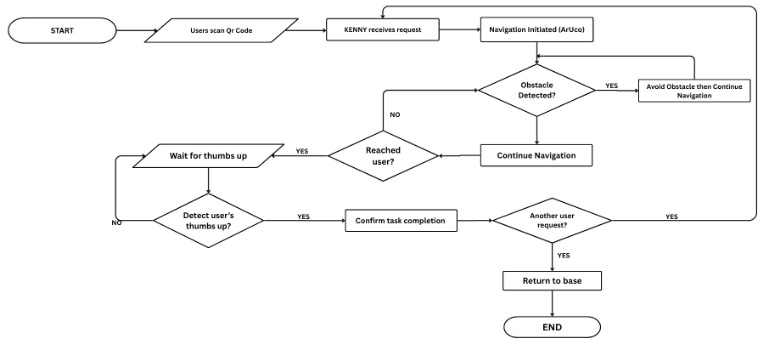

# KENNY Development Plan

**Project Title**

**KENNY: An Autonomous Indoor Waste Collection Robot Utilizing Reinforcement Learning, YOLOv8, and ArUco for Navigation and Detection**

---

# Project Goal

Develop an autonomous indoor waste collection robot capable of:

- Navigating indoor environments autonomously
- Avoiding obstacles using LiDAR
- Learning navigation through Reinforcement Learning (RL)
- Using ArUco markers for localization and navigation
- Recognizing a thumbs-up gesture using YOLOv8 to confirm task completion

The project will follow a **simulation-to-real (Sim-to-Real)** approach. The Reinforcement Learning model will first be trained and validated in simulation. Once it achieves reliable navigation and obstacle avoidance, it will be deployed and tested on the physical robot.

The final implementation and evaluation will be conducted at the **College of Computer Studies (CCS) Ground Floor**, which serves as the project's real-world deployment environment.

## Thesis SO

1. Develop, train, and evaluate a reinforcement learning model for adaptive path planning and obstacle avoidance using LiDAR data, and a YOLOv8 model for real-time
hand gesture recognition.
2. Implement ArUco marker for pose estimation and QR code scanning for indoor positioning and identification of user locations within the indoor environment.
3. Test and evaluate the overall performance of KENNY in terms of navigation efficiency, obstacle avoidance effectiveness, and gesture recognition accuracy.
---

# Phase 1 – Robot Design

## Goal

Design and build the physical robot that will be used throughout the project.

## Tasks

- Design the robot chassis
- Determine the robot dimensions
- Select motors, wheels, battery, and motor driver
- Design the waste collection mechanism
- Determine the placement of the LiDAR, camera, and other sensors
- Create the electrical wiring layout
- Assemble the first hardware prototype

## Expected Output

- Finalized robot design
- Fully assembled prototype
- Hardware ready for software integration

---

# Phase 2 – Reinforcement Learning Simulation

## Goal

Create a simulation environment where the Reinforcement Learning model can safely learn autonomous navigation before deployment to the physical robot.

## Tasks

### Simulation Environment

- Build a virtual indoor environment or based on the CCS Ground Floor
- Add walls, hallways, and obstacles
- Simulate robot movement
- Verify robot behavior


## Expected Output

- Functional simulation environment
- RL environment ready for training
- Robot can navigate safely in simulation

---

# Phase 3 – Reinforcement Learning Training and Validation

## Goal

Train the Reinforcement Learning model until it can navigate efficiently in simulation, then validate its performance on the physical robot.

## Tasks

### Simulation Training

- Select the RL algorithm(PPO)
- Train the navigation model
- Monitor training progress
- Evaluate navigation performance
- Tune hyperparameters

### Real-World Validation

- Deploy the trained RL model to the physical robot
- Test autonomous navigation in the CCS Ground Floor
- Evaluate obstacle avoidance performance
- Compare simulation and real-world performance
- Fine-tune the model if necessary

## Expected Output

- Trained RL navigation model
- Successful autonomous navigation in simulation
- Successful navigation and obstacle avoidance in the CCS Ground Floor

---

# Phase 4 – LiDAR Integration

## Goal

Integrate the LiDAR sensor to provide environmental awareness and obstacle detection for autonomous navigation.

## Tasks

- Install and configure the LiDAR sensor
- Process LiDAR scan data
- Detect nearby obstacles
- Integrate LiDAR data with the RL navigation model
- Validate obstacle detection during navigation

## Expected Output

- Reliable LiDAR sensor
- Accurate obstacle detection
- Stable obstacle avoidance during navigation

---

# Phase 5 – YOLOv8 Gesture Recognition

## Goal

Develop a gesture recognition system that detects a thumbs-up gesture to confirm successful task completion.

## Tasks

- Collect thumbs-up gesture images(datasets)
- Label the dataset
- Train the YOLOv8 model
- Evaluate detection accuracy
- Integrate gesture recognition into the robot system
- Test real-time gesture recognition

## Expected Output

- Trained YOLOv8 model
- Reliable real-time thumbs-up recognition

---

# Phase 6 – ArUco Marker Development

## Goal

Develop the ArUco marker system for localization and navigation within the CCS Ground Floor.

## Tasks

- Generate unique ArUco markers
- Assign marker IDs for different locations
- Print and prepare the markers
- Plan marker placement throughout the CCS Ground Floor
- Develop the ArUco detection module using OpenCV
- Detect marker IDs using the robot's camera
- Estimate marker position and orientation
- Integrate ArUco localization with the navigation system

## Expected Output

- Complete ArUco marker set
- Functional ArUco detection module
- Reliable localization using physical markers

---

# Phase 7 – System Integration

## Goal

Combine all software and hardware components into a complete autonomous robotic system.

## Tasks

- Integrate Reinforcement Learning navigation
- Integrate LiDAR obstacle detection
- Integrate ArUco localization
- Integrate YOLOv8 gesture recognition
- Synchronize sensor data
- Test the complete mission workflow

## Flowchart


## Robot Flow

```text
Start Task
      ↓
Navigate to User's Location
(RL + LiDAR)
      ↓
Identify Destination
(ArUco)
      ↓
Wait for User to Dispose Waste
      ↓
Detect Thumbs-Up Gesture
(YOLOv8)
      ↓
Confirm Task Completion
      ↓
Return to Home/Base or Next User Request
      ↓
Wait for the Next Task
```

## Expected Output

- Fully integrated autonomous robot

---

# Phase 8 – System Testing

## Goal

Evaluate the complete robotic system in the CCS Ground Floor.

## Tasks

- Test autonomous navigation
- Test obstacle avoidance
- Test ArUco localization
- Test thumbs-up gesture recognition
- Perform multiple mission trials
- Record system performance
- Improve the system based on test results

## Evaluation Metrics

- Navigation success rate
- Obstacle avoidance performance
- ArUco localization accuracy
- Gesture recognition accuracy

## Expected Output

- Stable and reliable autonomous robot
- Successful operation in the CCS Ground Floor

---

# Phase 9 – Documentation

## Goal

Document the entire development process and prepare the project for final evaluation.

## Tasks

- Record simulation results
- Record hardware testing results
- Record evaluation metrics
- Capture photos and demonstration videos
- Update project documentation
- Prepare presentation materials

## Expected Output

- Complete project documentation
- Final thesis materials
- Ready for final defense

---

# Overall Development Flow

```text
Robot Design
      │
      ▼
Build Simulation Environment
      │
      ▼
Train Reinforcement Learning Model
      │
      ▼
Validate RL in Simulation
      │
      ▼
Deploy RL to Physical Robot
      │
      ▼
Integrate LiDAR
      │
      ▼
Develop YOLOv8 Gesture Recognition
      │
      ▼
Develop ArUco Marker System
      │
      ▼
System Integration
      │
      ▼
System Testing in CCS Ground Floor
      │
      ▼
Evaluation and Optimization
      │
      ▼
Documentation
```

---

# Development Stack

## Programming Languages

- Python
- C++

## Robotics

-
-

## Artificial Intelligence

- Reinforcement Learning
- YOLOv8 (Ultralytics)

## Computer Vision

- OpenCV
- ArUco

## Sensors

- LiDAR
- Camera
-

## Development Tools

- Visual Studio Code
- 
-

## Hardware

- Raspberry Pi 
- LiDAR Sensor
- Camera
- DC Motors
- Motor Driver
- Battery
- Wheels
- Robot Chassis
-
-
-