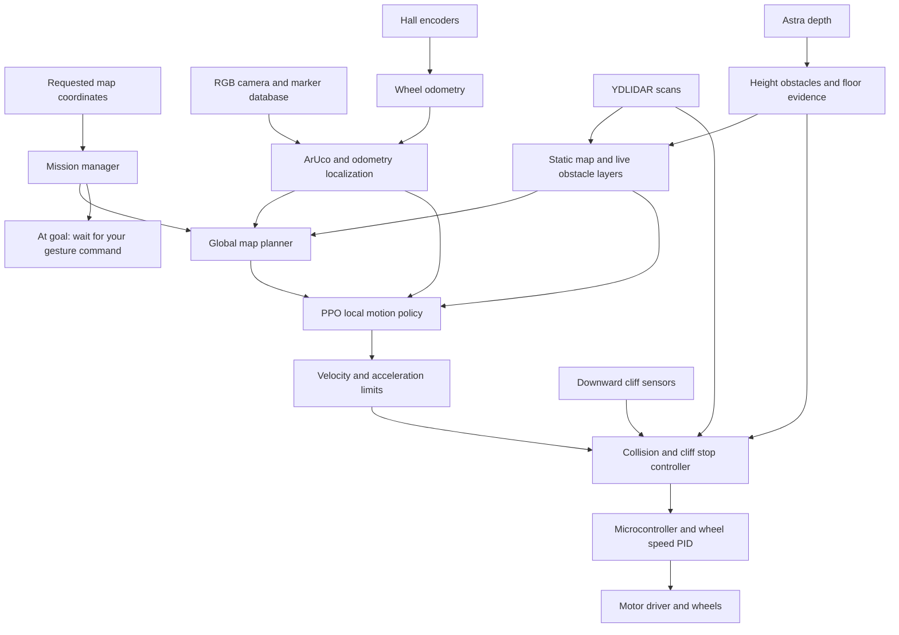

# KENNY: reinforcement learning, simulation, and robot setup

This is the implementation plan for a Raspberry Pi 5 robot running ROS 2 Jazzy with a YDLIDAR X3 Pro, an Orbbec Astra Pro, floor ArUco markers, and JGB37-520 encoder gearmotors with 80 mm wheels. It supplements the original development plan. It specifies work to build; it is not an already implemented navigation stack or a trained model.

## Implemented lightweight training stage

The runnable first-stage simulator and PPO tooling now live in this repository; see the [quickstart](../README.md) and [simulator fidelity notes](LIGHTWEIGHT_SIMULATOR.md). The selected workflow is lightweight laptop training, server experiments, then Gazebo validation. The ROS hardware stack described below remains planned work.

The user supplied an approximate 0.23 × 0.23 m body, 0.485 m total height, and 0.235 m wheel spacing. The simulator currently interprets spacing as center-to-center; sensor mounts and braking parameters still require measurement.

## 1. Recommended design

Use **PPO reinforcement learning for local motion**, a conventional map planner for routing, and ArUco plus wheel odometry for localization. Train first in the lightweight environment, then validate and refine in Gazebo Harmonic on a workstation; run only inference on the Pi. Hand recognition remains your separate training task.

The policy requests forward speed and turn rate. A motor controller translates those into wheel speeds and uses Hall encoder feedback to regulate them. Encoders measure rotation; the model does not command the encoders themselves.



All numbers below are initial engineering settings unless explicitly derived. Calibrate them on the assembled robot before deployment.

### Decisions and measurements needed

Assume two independently driven wheels and a passive caster. If you have four driven wheels, update the drive model and slip measurements before training.

| Item | What to record before finalizing simulation |
| --- | --- |
| Chassis | Width, length, total height including bin, wheel track, caster geometry, ground clearance |
| Dynamics | Empty/full mass, center of mass, achievable acceleration and stopping distance |
| Motors | Exact voltage variant, loaded RPM, gearbox ratio, stall current, encoder electrical levels |
| Encoders | Actual quadrature counts per wheel revolution, including decoding mode |
| Sensors | Mount positions/angles, minimum useful range, usable field of view, rates, latency |
| Camera | Original Astra Pro versus Pro Plus; USB identity, firmware, working ARM64 driver |
| Markers | Dictionary, printed side length, map pose and orientation, visibility distance |
| Compute | Pi RAM, cooling, storage, measured inference and perception timing |

## 2. Coordinates, markers, and navigation

Use meters in a common `map` frame: x/y on the floor, z upward. A goal `(8, 9)` means 8 m and 9 m from the surveyed origin, unless your database explicitly converts a different grid spacing to meters.

Markers are landmarks, not the robot's position and not necessarily waypoints. Seeing marker `(1,1)` means the camera can estimate its pose relative to that marker. The robot is generally some distance away from the marker center.

For your example, the distances from `(0,0)`, `(0,1)`, and `(1,1)` to `(8,9)` are approximately 12.04 m, 11.31 m, and 10.63 m. Thus `(0,1)` is closer than the start, although farther than `(1,1)`. A valid route may temporarily increase straight-line distance to get around a wall. Use A* or a Nav2 global planner over a traversability map, rather than always selecting the closest marker.

### Marker database

Store a full pose, not only x/y. For example, this is a proposed application schema, not a ROS parameter file:

```yaml
map_id: ccs_ground_floor_v1
frame_id: map
units: meters
dictionary: DICT_4X4_50
markers:
  - id: 0
    size_m: 0.20
    position_m: [0.0, 0.0, 0.0]
    orientation_xyzw: [0.0, 0.0, 0.0, 1.0]
  - id: 1
    size_m: 0.20
    position_m: [1.0, 1.0, 0.0]
    orientation_xyzw: [0.0, 0.0, 0.0, 1.0]
```

The example assumes marker +z points upward and printed marker +x aligns with map +x. Define the corner ordering and marker axes consistently with your pose solver, then survey the actual orientation. Cache this database on the Pi; localization must not depend on a network request for each detection.

Calibrate RGB intrinsics and distortion at the actual capture resolution. Detect corners and estimate pose using known physical marker size and a planar PnP solver. Reject detections with excessive reprojection error, implausible height/tilt, ambiguity, or large disagreement with predicted motion. Require consistent observations; combine multiple visible markers where possible. OpenCV describes the underlying marker detection and camera-relative pose conventions. [OpenCV ArUco documentation](https://docs.opencv.org/4.x/d5/dae/tutorial_aruco_detection.html)

Let `T_A_B` transform coordinates from frame B into A. Compute:

```text
T_map_base = T_map_marker × inverse(T_camera_marker) × inverse(T_base_camera)
```

Use the calibrated transform to the actual camera optical frame, including its different axis convention. Validate this equation with a stationary robot at several measured locations and headings before driving.

### Continuous localization and TF ownership

1. Wheel odometry provides continuous relative motion between detections. An IMU is a recommended addition for yaw-rate robustness, but is not assumed present.
2. A custom landmark localization node predicts from odometry and corrects with accepted marker measurements and covariance. Account for image timestamps and delayed observations.
3. During normal navigation, this node alone publishes `map -> odom`. The drive odometry node alone publishes `odom -> base_link`; robot state publisher owns fixed sensor links.
4. Maintain position/yaw covariance and time since a valid landmark. Slow down as uncertainty grows; stop when uncertainty exceeds the clearance budget. Missing one marker is not automatically a failure.
5. On a large inconsistent correction, stop and relocalize instead of moving with an abruptly shifted route. Do not teleport continuous wheel odometry to a marker.

During initial mapping, SLAM Toolbox owns `map -> odom`; the landmark node must not publish the same transform. Align the saved SLAM map to the surveyed marker frame using several measured correspondences, then switch to landmark localization for operation. AMCL is an optional separate localization baseline; combining its corrections with marker localization requires an explicit fusion design and one TF owner.

### Map and route setup

Teleoperate slowly to build a LiDAR occupancy map with SLAM Toolbox, inspect it in RViz, and save it. Add surveyed permanent drop-offs as keepout areas. Walls constrain global routes; live LiDAR/depth layers add newly observed obstacles. Plan with the full robot footprint and clearance margins. A marker database alone does not describe walls or which passages connect.

Place markers near starts, intersections, long corridors, and destinations. Choose spacing from measured odometry drift and camera detection range, not an assumed fixed interval. Test worn, partly hidden, and poorly lit markers. If the Astra viewing angle cannot cover both floor markers and overhead hazards, add a small downward RGB camera for ArUco.

## 3. Assemble and calibrate the robot

### Drive and wiring

Use a microcontroller with quadrature encoder inputs and a dual motor driver rated for the motors' voltage and measured stall current. Connect motor power through a fuse and an accessible emergency stop that disables drive power or driver enable. Supply the Pi from an appropriate regulated rail; do not power motors through the Pi. Match encoder signal voltage to the MCU inputs and follow the driver's grounding requirements.

Run wheel speed PID initially at 100–200 Hz on the MCU. Receive bounded left/right wheel targets from the Pi, return timestamped encoder counts and fault status, and disable drive when commands are stale. Start with a 200 ms command watchdog and verify actual braking behavior; power removal may coast rather than brake. Test serial disconnect and a crashed Pi process with wheels raised first.

For wheel radius `r = 0.04 m`:

```text
wheel circumference = 2πr = 0.2513 m
333 RPM × 0.2513 / 60 ≈ 1.395 m/s nominal wheel surface speed
ω_left  = (v - ω × track_width / 2) / r
ω_right = (v + ω × track_width / 2) / r
distance_per_encoder_count = 2πr / counts_per_wheel_revolution
```

The 1.395 m/s figure assumes 333 RPM at the gearbox output and is not a safe operating target or guaranteed loaded speed. Begin physical trials at 0.10 m/s, with a provisional policy maximum of 0.30 m/s and turn rate of 0.60 rad/s. Do not assume every JGB37-520 listing has the same encoder count or gearing.

Measure counts over several full wheel revolutions, verify signs, then calibrate effective radius and wheel separation using straight runs and full turns under load. Fit deadband, left/right imbalance, acceleration, and braking behavior. Repeat with the bin loaded. Clamp wheel targets and rescale both together when necessary to preserve curvature.

### Sensor mounting

Mount the X3 Pro level with a clear scan plane. Mount the Astra to see the swept body volume, including obstacles above the LiDAR plane and near the floor. Measure coverage with real chair seats, legs, hanging objects, bags, and the robot's own bin in place. A chair or bag may be detected by LiDAR if it intersects the scan; the relevant failure case is geometry outside that plane.

Measure camera-to-base and LiDAR-to-base transforms. Verify RGB/depth registration, units, timestamps, and optical frames with a known-size target. Do not assume RGB and depth pixels correspond without registration. Provide strain relief, cooling, and adequate USB power; test all sensors simultaneously.

### Cliff sensing is a required hardware extension

A horizontal LiDAR does not reliably detect missing floor. Forward depth can provide advance floor evidence, but its near blind zone, limited viewing angle, dark surfaces, and invalid returns prevent it from being the only cliff safeguard.

Add downward range sensors covering the leading wheel paths and side edges swept during turns. Add rear coverage before allowing reverse; default to no reverse. Connect the close-range cliff stop to the MCU so it can stop even if ROS or the policy fails. Their mounting must detect an edge before a supporting wheel can reach it, including diagonal approaches.

Calculate a minimum margin using measured values:

```text
required_stop_distance = v × worst_case_latency + v² / (2 × minimum_braking_deceleration)
                        + geometry_and_measurement_margin
```

Example only: at 0.30 m/s, 0.20 s latency, 0.50 m/s² deceleration and a 0.10 m margin, the distance is 0.25 m. If downward sensors only see 0.05 m ahead of the wheel, that speed/mounting is unacceptable. Include sensor sampling delay, filtering, command transport, braking onset, payload, and low battery. Verify stopping experimentally; do not infer it from nominal RPM.

With only the listed LiDAR and Astra, restrict operation to a physically bounded level-floor area while developing perception. Autonomous operation near real unguarded drops is not a completed capability until the additional coverage and stop tests pass.

## 4. Perception and independent stopping

Convert depth into base-frame points using calibration and timestamped TF. Remove the robot's own geometry and classify floor separately. Mark points intersecting the robot's full height envelope as collision obstacles in a 2D projection; include a height margin. Preserve overhangs that could hit the bin even when the space beneath them is clear. Use conservative height filtering so thin bags are not erased as floor.

Maintain an egocentric obstacle representation combining LiDAR and depth. Keep observed-free, occupied, and unknown separate. Missing depth is unknown, not automatically a cliff and never automatically free. Ray clearing must only clear regions actually observed; a front camera cannot clear behind the robot. Retain obstacles through short occlusions and stop when their uncertainty makes the swept path unsafe.

For cliff evidence, compare expected ground depth with observed ground, estimate a local floor plane when enough reliable floor points exist, and identify significant drops below it. Use calibrated tolerances for uneven floor and ramps. Fuse this with downward sensor readings. Black mats, reflective floors, sunlight, occlusion, and sensor disconnection must be explicit tests. Lack of trustworthy floor evidence blocks motion into that region.

People can be avoided geometrically without a person classifier. Use consecutive observations to expose motion to the policy, increase clearance, and allow waiting rather than squeezing past. A person detector can later improve behavior but is not the primary collision safeguard.

Use Nav2 Collision Monitor for proximity stop/slowdown from scans and obstacle clouds, plus a custom cliff/freshness gate. The monitor is a software layer and does not certify this robot's safety. Keep it after smoothing so an emergency zero is not smoothed into gradual deceleration. [Nav2 Jazzy Collision Monitor](https://docs.nav2.org/jazzy/tutorials/general_tutorials/using_collision_monitor/using_collision_monitor/)

```text
RL or baseline or teleop (one selected source)
  -> velocity/acceleration limiter
  -> Collision Monitor
  -> cliff, localization, sensor-age and command-age gate
  -> motor interface
  -> MCU watchdog / cliff interlock / wheel PID
```

No alternative publisher may bypass this chain. Stop on stale required sensors, missing TF, invalid policy output, localization failure, emergency stop, or lost motor link. Choose source timeouts from measured rates and the stopping budget. Restarting a sensor must not automatically release a latched cliff or emergency stop.

## 5. Build the training environment

Use **Gazebo Harmonic with ROS 2 Jazzy** on an Ubuntu 24.04 workstation; this is the documented pairing. Start with one environment and headless simulation, then parallelize only after profiling. [Gazebo ROS installation](https://gazebosim.org/docs/harmonic/ros_installation/)

Model the actual footprint, complete body height, wheel radius, measured track width, mass/inertia, caster, friction, torque limits, braking, and speed controller. Use collision geometry for both body and bin. Match sensor mounting, field of view, clipping ranges, update rates, and blind zones. A purely top-down simulator cannot validate overhangs or cliffs.

### World contents and curriculum

| Stage | Scenarios | Advancement target |
| --- | --- | --- |
| 0 | Empty room, randomized start/yaw/goal | Reach goal and stop without oscillation |
| 1 | Blocks, walls, corridors, corners | Clear full footprint, including turns |
| 2 | Mazes, U-shaped traps, cul-de-sacs, blocked routes | Follow planner detours and request replans |
| 3 | Chairs with legs/seat/back; low and hanging bags; overhangs | Avoid collisions invisible at LiDAR height |
| 4 | Walking people, crossings, sudden occlusion, narrow passing | Yield or stop with clearance |
| 5 | Missing floor tiles, pits, stair lips, diagonal edges | Avoid unsupported floor and use stop interlock |
| 6 | Combined clutter, hidden markers, sensor delays, payload changes | Meet held-out evaluation gates |

Begin with roughly 12 × 12 m worlds so goals such as `(8,9)` fit, then vary size and connectivity. Derive doorway and corridor widths from the measured footprint plus margins. Construct chairs from geometry, not just solid cubes: a seat over an empty scan plane is an essential test. Render bags with varied low heights, soft-looking outlines, and depth dropouts; physical softness need not be simulated initially.

Cliff worlds need actual gaps in collision-supported floor, not painted black squares over an infinite ground plane. Terminate an episode when a support wheel crosses the permitted boundary, before a long simulated fall. Dynamic person models must have moving collision geometry; verify this explicitly rather than assuming visual actors collide.

Separate training, validation, and test world seeds/layouts. Include entirely unseen mazes and obstacle combinations in testing. Use simulator truth for collision/fall labels and evaluation only; never feed true pose, hidden objects, or perfect floor labels into the deployed policy observations.

### Simulated markers and sensor realism

Early experiments may emulate marker measurements with field-of-view checks, occlusion, distance limits, noise, and missed detections. Before deployment, validate with rendered floor markers and the real RGB detector. Run the same localization and perception code in simulation and on the robot. The policy must experience odometry drift and landmark corrections.

Randomize mass/payload, wheel radius and track error, friction/slip, motor imbalance/deadband, braking response, sensor pose error, range noise, latency, dropouts, lighting, marker occlusion, and depth invalid regions. Start around measured values with modest ranges, such as ±10% mass or ±2% wheel radius, then replace these provisional ranges with bench data. Randomize each episode and log its seed.

### Gymnasium environment contract

Implement `reset(seed, options)` and `step(action)` with fixed simulation-time increments. At 10 Hz policy rate, advance 0.1 s of simulated time per action while physics and wheel control run faster. Wait for sensor messages newer than the step boundary; do not train from uncontrolled wall-clock sleeps.

On reset clear odometry, localization, costmaps, sensor buffers, policy history, and command/watchdog state. Randomize a valid start and reachable goal. A collision, cliff boundary violation, or goal reached is `terminated`; the episode time limit is `truncated`. Log infrastructure faults separately from navigation failure. Every worker needs its own ROS domain or isolated graph, Gazebo transport partition, topics, and random seed. Verify that reset in one worker cannot move another.

## 6. PPO specification

Use Stable-Baselines3 PPO as the first algorithm and a small MLP with four stacked observation frames. This avoids deploying image-scale neural perception on the Pi for the first version. PPO supports continuous actions; the following architecture and training values are project proposals, not a promise of convergence. [Stable-Baselines3 PPO](https://stable-baselines3.readthedocs.io/en/master/modules/ppo.html)

### Observation contract

Define a versioned feature schema and use identical preprocessing for training and inference:

| Feature | Proposed encoding |
| --- | --- |
| LiDAR | 72 angular minimum-range bins plus 72 validity values |
| Depth collision geometry | 36 angular nearest-obstacle bins spanning the calibrated camera view plus 36 validity values |
| Floor support | 12 forward sectors with drop evidence and 12 valid/unknown values |
| Downward sensors | One normalized range and health/validity pair per actual sensor |
| Route | Three lookahead points in base coordinates, clipped/normalized, with validity flags |
| Goal | Relative x/y, distance, sin/cos heading error when an arrival heading is required |
| Motion | Measured v/omega, previous requested action, previous executed action |
| Localization | Position/yaw uncertainty, marker age, localization health |
| Timing | Age of each sensor source, stop/intervention status |

Ranges are in meters before normalization; explicitly distinguish no return from a known clear maximum-range return according to driver semantics. Preserve thin-obstacle minima when binning. Unknown camera sectors are never treated as observed free. Prohibit reversing and constrain turns with unknown swept space; the safety layer uses richer geometry than these compact policy features.

Stack four 10 Hz observations for short motion history. Clip features to documented bounds and freeze saved normalization statistics during evaluation. If temporal ambiguity remains, evaluate a recurrent policy later with explicit hidden-state reset handling.

### Actions

Two normalized continuous values map to `v in [0, 0.30] m/s` and `omega in [-0.60, 0.60] rad/s`. Apply the same acceleration and wheel-speed limits in simulation and deployment. Zero linear speed must be expressible; the safety layer can always force an exact stop. Reverse is disabled initially. In-place rotation is allowed only when the full swept footprint has obstacle and cliff clearance.

The global planner supplies local route targets. If the robot remains stuck, stop and ask for a replan; do not train random recovery motions near unknown floor.

### Starting reward

Use route progress rather than straight-line marker distance. For a fixed planned route, calculate distance-to-go along it with a bounded cross-track penalty. Do not award progress on route replacement or localization jumps; rebase the reward reference then.

```text
r = 5 × clipped_route_progress_m
    - 0.01 per step
    - 0.05 × squared_change_in_normalized_action
    - proximity_penalty
    - 0.5 when the stop controller intervenes
    + 20 once on successful arrival
    - 50 on body collision or cliff boundary violation (terminate)
```

Tune weights from logged behavior. Cap unsafe-proximity shaping so it does not swamp goal reward, but ensure shortcuts through obstacles cannot beat valid paths. Waiting briefly for people should cost less than an unsafe approach. No marker-sighting reward: that can teach circling a marker instead of completing a task.

Train with the same stop controller used in deployment and record requested versus executed commands. Count interventions so a policy that repeatedly drives into the stop boundary is not called successful avoidance. Evaluate the unshielded policy only in simulation to expose dependence on the guard.

### Initial training recipe

| Setting | Starting value |
| --- | --- |
| Policy/value hidden layers | Two layers of 128 units each |
| Environments | 1 for debugging, up to 8 after profiling |
| Learning rate | 0.0003 |
| Rollout length | 1,024 steps per environment |
| Minibatch | 256, divisible into the collected rollout |
| Epochs | 10 |
| Discount / GAE lambda | 0.99 / 0.95 |
| PPO clipping | 0.2 |
| Entropy coefficient | 0.005, tune if exploration or jitter persists |
| Episode limit | Start at 120 s, scale with route length |
| Initial experiment budget | 1–5 million total transitions across workers, then reassess |

Run at least three training seeds. Evaluate held-out scenarios every 50,000–100,000 transitions. Select checkpoints by collisions, falls, interventions, and success, not reward alone. Preserve earlier scenarios when advancing curriculum to avoid forgetting. Estimate wall time from measured aggregate simulation steps per second; a GPU does not automatically make ROS/Gazebo sampling fast.

Save the policy, normalizer, feature ordering, action scaling, robot geometry, driver revisions, dependency versions, training seeds, world generator version, and evaluation report together. A model without its preprocessing is not a deployable artifact.

## 7. ROS 2 Jazzy installation and driver guide

These commands are instructions to run on the target machines, not changes performed by this document. Commands assume Bash. The repository currently contains documentation only; custom KENNY nodes and launch files described below still need implementation.

### Pi operating system and base packages

Install Ubuntu Server 24.04 LTS **64-bit ARM64** on the Pi 5, configure cooling/network/time synchronization, and update the OS. Jazzy provides Ubuntu Noble ARM64 support. Configure the official ROS apt repository using the current Jazzy installation guide before installing these packages. [Jazzy platform support](https://docs.ros.org/en/jazzy/Installation/Alternatives/Ubuntu-Install-Binary.html), [official apt setup](https://docs.ros.org/en/jazzy/Installation/Ubuntu-Install-Debs.html)

```bash
sudo apt update
sudo apt install ros-jazzy-ros-base ros-dev-tools build-essential cmake git python3-venv \
  ros-jazzy-navigation2 ros-jazzy-nav2-bringup ros-jazzy-slam-toolbox \
  ros-jazzy-robot-localization ros-jazzy-robot-state-publisher ros-jazzy-xacro \
  ros-jazzy-cv-bridge ros-jazzy-image-transport ros-jazzy-tf2-ros
source /opt/ros/jazzy/setup.bash
mkdir -p ~/kenny_ws/src
# Run init only if rosdep has not already been initialized.
sudo rosdep init
rosdep update
```

Use the same ROS domain ID on Pi and workstation when connecting them; use different IDs for isolated training workers. Run RViz on the workstation to save Pi resources. Set `use_sim_time: false` on hardware and `true` in simulation, with `/clock` bridged from Gazebo.

### YDLIDAR X3 Pro

Build the vendor SDK, then the ROS driver. The vendor currently directs Jazzy users to the driver’s `humble` branch. Record tested commit hashes before freezing your setup. [YDLIDAR driver instructions](https://github.com/YDLIDAR/ydlidar_ros2_driver)

```bash
mkdir -p ~/vendor_src
git clone https://github.com/YDLIDAR/YDLidar-SDK.git ~/vendor_src/YDLidar-SDK
cmake -S ~/vendor_src/YDLidar-SDK -B ~/vendor_src/YDLidar-SDK/build
cmake --build ~/vendor_src/YDLidar-SDK/build -j2
sudo cmake --install ~/vendor_src/YDLidar-SDK/build
sudo ldconfig
git clone --branch humble https://github.com/YDLIDAR/ydlidar_ros2_driver.git \
  ~/kenny_ws/src/ydlidar_ros2_driver
cd ~/kenny_ws
rosdep install --from-paths src --ignore-src -r -y --rosdistro jazzy
colcon build --symlink-install --parallel-workers 2
source install/setup.bash
```

Before launch, edit the checked-out driver's parameter file for your exact X3 Pro revision: serial port, baud rate, sample rate, scan frequency, single-channel mode, range limits, inversion, and `frame_id`. Do not run unrelated default model settings or assume X3 and X3 Pro are interchangeable. Use the supplied device manual/SDK model table to confirm values; this guide deliberately does not claim an unverified X3 Pro parameter set.

Create a stable serial device rule or use `/dev/serial/by-id/` when available, and grant the user appropriate serial permissions. Then launch the configured driver:

```bash
ros2 launch ydlidar_ros2_driver ydlidar_launch.py
# In another sourced terminal:
ros2 topic hz /scan
ros2 topic echo /scan --once
```

In RViz check scale, orientation, missing sectors, the closest usable range, and scan stability while motors run. Sensor-frame naming must match the URDF.

### Astra Pro: do this compatibility test first

The original **Astra Pro is not Astra Pro Plus or Astra 2**. Orbbec's newer wrapper defaults to its v2 branch and directs legacy OpenNI users elsewhere. That is not proof that the original Pro works on Jazzy/ARM64. [Orbbec wrapper branch guidance](https://github.com/orbbec/OrbbecSDK_ROS2)

Use the vendor's legacy `ros2_astra_camera` as the first integration candidate. Its README uses older ROS examples, so compiling and streaming on Noble/Jazzy is an explicit project gate, not a guaranteed installation. [Legacy Orbbec driver](https://github.com/orbbec/ros2_astra_camera)

1. Record USB device IDs and firmware, and confirm a matching ARM64 OpenNI runtime/SDK for the physical device.
2. In a separate `~/astra_ws/src` workspace, clone the legacy driver. Follow its dependency instructions for `libuvc`, OpenNI, and vendor udev rules, substituting Jazzy for obsolete ROS distribution names. Resolve any CMake/API incompatibilities and record patches.
3. Run `rosdep install --from-paths src --ignore-src -r -y --rosdistro jazzy`, then `colcon build --parallel-workers 2 --cmake-args -DCMAKE_BUILD_TYPE=Release` from that workspace.
4. Source its install setup and inspect the installed launch files. Select the `astrapro` variant if included in that revision; do not silently use another camera's configuration. Inspect launch arguments with `ros2 launch astra_camera astrapro.launch.xml --show-args` if that file exists.
5. Inspect `ros2 topic list -t`. Verify color and depth images, both camera-info streams, their frame IDs, and point cloud or your depth-to-cloud conversion. Topic names vary by driver; remap to the KENNY interface below.
6. Run simultaneous RGB/depth/LiDAR for at least 30 minutes and inspect USB resets, timestamp drift, dropped frames, CPU use, and temperature. Confirm a measured wall distance and actual floor-marker detections.

If the ARM64 legacy SDK or wrapper cannot work, stop this integration milestone and resolve a documented port, a separately validated sensor bridge, or a hardware change before claiming Pi deployment. Do not substitute an x86 binary on ARM64. Simulation work can continue while this is resolved.

### Workstation simulator and training environment

Use Ubuntu 24.04 on the workstation and configure the same official ROS apt repository:

```bash
sudo apt install ros-jazzy-desktop ros-jazzy-ros-gz python3-venv
source /opt/ros/jazzy/setup.bash
python3 -m venv --system-site-packages ~/venvs/kenny-train
source ~/venvs/kenny-train/bin/activate
python -m pip install --upgrade pip
python -m pip install stable-baselines3 gymnasium tensorboard
python -m pip freeze > ~/venvs/kenny-train/requirements-tested.txt
```

Pin the resolved working versions in the implementation repository. Avoid pip-installing over system ROS packages. Add the simulator, environment wrapper, and custom nodes before attempting a training command; no `train.py` exists yet. Use `ros_gz_bridge` for clock, scans, images/camera info, and required simulation topics. Ensure only one simulated drive implementation actuates wheels.

## 8. ROS implementation contracts

Create these packages as subsequent implementation tasks:

| Package | Responsibility |
| --- | --- |
| `kenny_description` | URDF/xacro, collision geometry, sensor transforms |
| `kenny_hardware` | MCU protocol, encoder odometry, wheel target conversion, faults |
| `kenny_localization` | ArUco detector, local database, gated landmark/odometry fusion |
| `kenny_perception` | Depth projection, floor evidence, obstacle/floor observations |
| `kenny_navigation` | Map/planner interface, route lookahead, baseline and policy selection |
| `kenny_rl` | Feature builder, PPO inference, version/normalizer checks |
| `kenny_safety` | Cliff/freshness/localization gate and stop latching |
| `kenny_missions` | Goal requests, arrival, gesture interface, task state |
| `kenny_sim` / `kenny_training` | Worlds, reset/step interface, curriculum and evaluation |
| `kenny_bringup` | Hardware/simulation launch files and validated configuration |

Suggested canonical topics, to be implemented and remapped from driver outputs:

| Topic | Message/meaning |
| --- | --- |
| `/scan` | `sensor_msgs/LaserScan` |
| `/camera/color/image_raw`, `/camera/color/camera_info` | `sensor_msgs/Image`, `sensor_msgs/CameraInfo` |
| `/camera/depth/image_raw`, `/camera/depth/camera_info` | Depth image and calibration |
| `/obstacles/points` | `sensor_msgs/PointCloud2`, filtered collision obstacles |
| `/wheel/odom` | `nav_msgs/Odometry`, continuous local estimate |
| `/localization/pose` | `geometry_msgs/PoseWithCovarianceStamped`, map-frame estimate |
| `/plan` | `nav_msgs/Path` in map coordinates |
| `/cmd_vel/policy`, `/cmd_vel/safe` | `geometry_msgs/TwistStamped`, explicit freshness |
| `/safety/status` | Custom timestamped stop reasons, sensor health, latch state |
| `/mission/goal` | Proposed action: map pose, goal ID, tolerances; feedback and cancellation |
| `/gesture/command` | Proposed message: mission ID, timestamp, command, confidence |

Explicitly adapt stamped/unstamped velocity messages where the installed Jazzy components require it. Inspect actual topic types with `ros2 topic info -v`; a remap cannot convert message types. On an unstamped boundary track receipt time and preserve freshness checks before that boundary.

Start with a Nav2 conventional controller baseline to validate hardware and perception. For RL integration, implement a Nav2 controller plugin wrapping inference, or an explicitly separate policy node consuming the global path. Choose one approach; do not leave Nav2's controller and RL both commanding the base. A separate node needs its own progress, cancellation, and goal-completion integration.

### Bringup and calibration order

1. Test motor directions, encoder signs, MCU watchdog and emergency stop with wheels raised.
2. Verify robot state publisher and all fixed frames in RViz.
3. Start drivers and check timestamps, rates, distance units, and calibration.
4. Test collision/cliff gates under teleoperation at low speed.
5. Calibrate straight and turning odometry; test marker localization while stationary and moving.
6. Map the site, align it to markers, save map/database versions, add keepouts.
7. Run conventional planner/controller baseline through the same stop chain.
8. Run RL in shadow mode: log proposed commands while a validated controller drives.
9. Enable RL at 0.10 m/s only after the evaluation gates below pass.

Useful diagnostics after relevant nodes exist:

```bash
ros2 topic list -t
ros2 run tf2_ros tf2_echo map base_link
ros2 topic hz /scan
ros2 topic hz /wheel/odom
ros2 topic info /cmd_vel/safe -v
ros2 bag record /scan /wheel/odom /localization/pose /tf /tf_static \
  /cmd_vel/policy /cmd_vel/safe /safety/status
```

Record camera data selectively to avoid exhausting storage and USB/CPU bandwidth. Keep bag metadata with map, marker database, calibration, and model versions.

## 9. Deploy inference on Raspberry Pi 5

Benchmark the compact policy first with a supported ARM64 runtime; ONNX Runtime CPU is a candidate after exporting the deterministic actor. Validate runtime/package availability on the exact Pi OS before choosing it. PyTorch inference is an alternative if measured latency and memory allow it.

Export preprocessing or package it explicitly, including stacked-frame ordering, normalization, clipping, and action scaling. Compare outputs from the training model and deployment runtime on recorded observations, including NaNs, unknown sectors, and limit cases. Do not deploy an exporter solely because a file was produced.

Target 10 Hz policy updates with p95 inference below 20 ms as an initial acceptance budget, not a Pi performance claim. Also measure the complete sensor-to-motor delay, worst-case stalls, CPU, memory, temperature and dropped sensor frames with every node active. Reduce depth resolution/rate only after checking minimum obstacle and marker detection performance. A small MLP may be cheap while point-cloud processing is the actual bottleneck.

If inference misses its deadline, the command-age gate stops the robot. Do not hold the last moving command indefinitely. Startup should keep the drive disabled until calibration, model contract, localization, sensor freshness, and motor health are valid.

## 10. Mission workflow and gesture handoff

```text
IDLE -> VALIDATE_GOAL -> LOCALIZE -> PLAN -> NAVIGATE
     -> ARRIVAL_CHECK -> WAIT_FOR_GESTURE -> COMPLETE
Any moving state -> STOPPED_FAULT when required health/clearance is lost
```

Validate the requested map ID, coordinates, free goal footprint, and reachability. Navigate toward the route with marker corrections along the way. For the first version, require an arrival marker observation, position error within a provisional 0.20 m, valid localization uncertainty, and nearly zero speed for one second. Use an orientation tolerance if the camera must face the user. If the destination itself is unreachable, report that rather than declaring arrival at a nearby marker.

At arrival keep the wheels stopped and enable your hand-command consumer. Accept only commands intended for the active mission and recent enough to be valid; debounce recognition and define what each gesture means. You supply the recognition model. A new/return goal re-enters the same navigation workflow. Missing gestures cause waiting or a configured timeout, not wandering.

## 11. Evaluation and release gates

Proposed targets below must be reviewed against the site's real clearance needs; they are not measured results or a safety guarantee.

| Gate | Evidence required |
| --- | --- |
| Hardware | Stable streams for 30 minutes; verified motor direction/counts; stop on link/process failure |
| Geometry | Overhang above scan height and bag below scan height both stop robot before contact |
| Localization | Surveyed position/yaw errors and drift recorded; uncertainty fits route clearance; false marker tests rejected |
| Simulation | At least 500 held-out episodes across three trained seeds; report each scenario class separately |
| Navigation target | At least 95% reachable-goal success; zero observed body collisions or cliff crossings in release evaluation |
| Guard dependence | Report intervention rate and unshielded simulation results; improvement over training checkpoints |
| Pi timing | Policy deadlines and total stopping latency met under full workload and thermal steady state |
| Physical rollout | At least 30 varied supervised low-speed missions, increasing complexity only after passing earlier cases |
| Cliff behavior | No wheel reaches an edge in tethered/guarded tests, including diagonal approach, turning, sensor loss, and low battery |

Measure route length relative to a valid planned route, time to goal, minimum footprint clearance, localization error, false stops, collision/fall counts, sensor faults, and requested/executed velocity differences. Include confidence intervals and failed runs, not only successful demonstrations. Zero observed failures in finite testing does not establish a zero failure probability.

Compare conventional Nav2 and RL using the same maps, perception, speed limits, and stop controller. Perform simulation ablations: LiDAR only; LiDAR plus depth; with/without marker corrections; with/without randomization; and guarded versus unguarded policy. Never disable the physical cliff interlock to collect an ablation.

Required regression cases include hidden chair legs with visible seat, thin bag on the floor, hanging bag, crossing person, temporarily blocked corridor, U-shaped trap, repeated/unknown marker ID, covered marker, black mat, reflective floor, missing depth, USB disconnect, stalled inference, encoder fault, and a goal across an impassable gap.

## 12. Implementation sequence and deliverables

1. **Compatibility and measurements:** Astra/LiDAR on Pi, motor/encoder characterization, sensor coverage and cliff hardware. Deliver a tested hardware sheet and driver revision list.
2. **Base control and localization:** MCU firmware, URDF, odometry, ArUco/database fusion, stop chain. Deliver surveyed localization and braking results.
3. **Mapping and conventional baseline:** map alignment, obstacle projection, cliff keepouts, planner and mission state machine. Deliver repeatable baseline routes.
4. **Simulation parity:** measured robot, realistic sensors, block/maze/chair/bag/person/cliff worlds. Deliver replayable seeds and reset/step tests.
5. **PPO experiments:** observation/action contract, curriculum, three seeds, checkpoint selection and ablations. Deliver model plus full preprocessing and evaluation bundle.
6. **Pi deployment:** numerical parity, timing, shadow tests, guarded physical trials. Deliver a launch/configuration bundle and stop-test evidence.
7. **Gesture integration:** connect your independently trained command detector to the arrival state and repeat full missions.

Finish each gate before depending on it in the next phase. In particular, integrate sensors and measure the robot before final training, so the policy learns the system that will actually be deployed.
